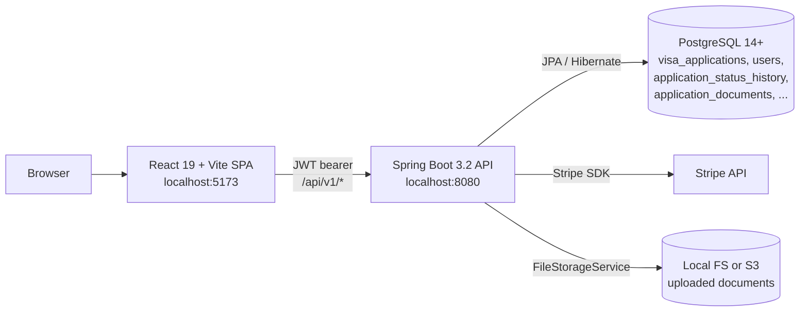
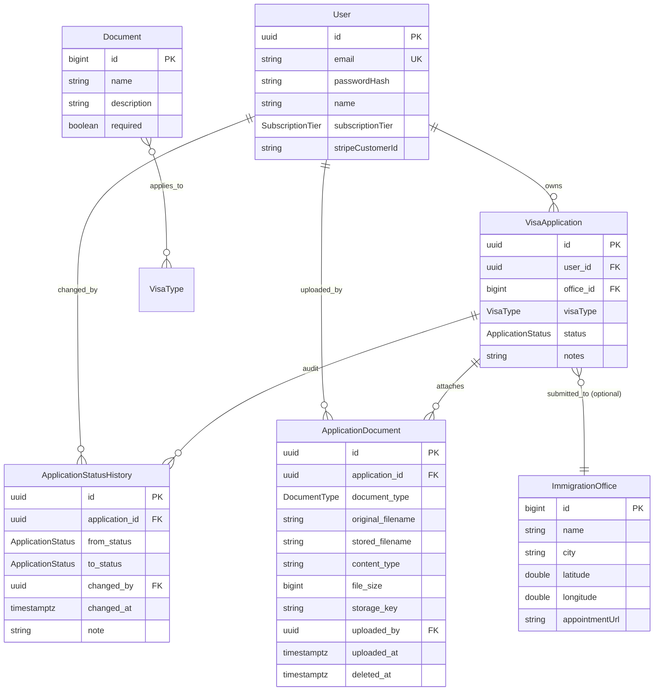
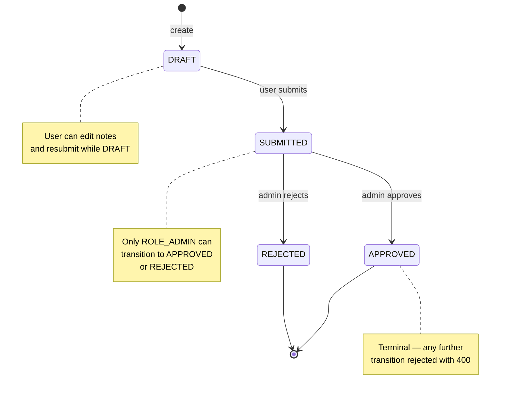

# Architecture

This document explains how the codebase is put together. **Two architectures coexist**: the post-pivot Köln sub-products (the current focus, all frontend) and the pre-pivot CRM (Spring Boot, deployed but in maintenance). Read both sections to understand any given file's lineage.

## Köln sub-products (current focus, May 2026 → )

Two standalone React flows live under `frontend-web/src/pages/`:

```
/                            → src/pages/Home.tsx               (public landing → links to both)
/anmeldung-koeln             → src/pages/AnmeldungKoeln.tsx     (12 screens, shipped v1.3)
/auslaenderbehoerde-koeln    → src/pages/AuslaenderbehoerdeKoeln.tsx (9 screens, shipped v1.0)
```

Each sub-product is a single React component that mounts its own state machine + screen router. **Zero new backend endpoints.** All flow state lives in `localStorage` under a per-product key with `schemaVersion: 1`:

- `helfa.anmeldung-koeln.state`
- `helfa.auslaenderbehoerde-koeln.state`

### Per-flow internal layout

Each sub-product folder follows the same shape:

```
src/pages/<flow-name>/
  types.ts                 — <Flow>State + initialState + FlowApi
  state.ts                 — load/save/clear localStorage + deriveScreen()
  use<Flow>State.ts        — React hook returning FlowApi
  ScreenRouter.tsx         — useMemo'd derive → switch over ScreenId
  screens/                 — one file per screen, each takes { flow: FlowApi }
  components/              — flow-specific UI (FlowShell, PhraseOverlay, etc.)
  formFill.ts              — pdf-lib form-fill (lazy-imported inside the function)
  parseConfirmation.ts     — German confirmation-email parser
  calendar.ts              — .ics builder + Google Calendar deep links
  *.test.ts                — vitest unit tests co-located with their module
```

### Single-source-of-truth state machines

Neither sub-product persists `state.screen`. The current screen is **derived** from the data + intent fields on every render via `deriveScreen()`. The router wraps it in `useMemo`. This guarantees we can't drift between "what the user sees" and "what the state actually says."

Four intent flags (`started`, `documentsConfirmed`, `wentToAppointment`, `wasSentHome` in Anmeldung; similar set in Ausländerbehörde) capture user actions that aren't otherwise represented in a data field.

### Form-fill via the live official PDF

Both sub-products fill Köln's official AcroForm PDFs directly:

- **Anmeldung:** `34-F27_Anmeldung_v04_Vorl-1.10.pdf` (73 fields)
- **Residence permit:** `33-F07_ErstantragErteilung_befristetenAufenthaltstitels-V10_Vorl-1.12.pdf` (130 fields)

The form server (`formular-server.de`) sends `Access-Control-Allow-Origin: *`, so the browser fetches the live PDF on every Generate — no bundled snapshot, no drift risk if Köln tweaks the form.

`pdf-lib` (~150 KB gz) is **dynamically imported** inside `fillAnmeldeformular()` / `fillResidencePermitForm()` so it doesn't sit in the initial bundle. Vite code-splits it. The PDF fetch and the pdf-lib import run via `Promise.all` to overlap latency.

### Cross-flow continuity

The residence-permit flow **reads** the Anmeldung flow's `localStorage` (via `formFill.ts:readAnmeldungSnapshot`). This:

- Auto-skips the "have you done Anmeldung?" question if the Meldebescheinigung was recorded in the same browser.
- Pre-fills the residence-permit form with personal details the user already entered.
- Pre-routes the booking screen to the right Bezirksamt based on Köln postal code.

Works because both flows live on the same origin and write to known `localStorage` keys. **No backend, no shared schema, no migrations** — a documented contract between two sub-products.

### Testing

`vitest` for pure functions, co-located as `*.test.ts`. **82 tests** as of v1.0 (Ausländerbehörde): parsers, state machines, PLZ→Bezirksamt mapping, ICS builder, code mappings. Run `npm test` in `frontend-web/`.

### Public surface area

```
/                          public landing
/anmeldung-koeln           Anmeldung flow (no auth)
/auslaenderbehoerde-koeln  residence-permit flow (no auth)
/imprint, /privacy, /terms public legal pages
```

All other routes (`/login`, `/dashboard-legacy`, `/onboarding`, etc.) are pre-pivot CRM routes — still mounted, still gated by `ProtectedRoute`, but `robots.txt` disallows them.

### Error-handling + analytics

`<ErrorBoundary>` at the app root catches runtime crashes and surfaces a friendly Restart instead of a white page. `<Analytics />` from `@vercel/analytics` is mounted alongside the router — cookieless, no PII, no signup.

---

## Pre-pivot CRM (legacy, deployed but in maintenance)

The sections below describe the pre-pivot Spring Boot CRM (`VisaApplication` / status workflow / admin approval) still live behind `/login`. **The Köln sub-products are NOT built on top of this** — they share the deployment but not the data model. If you're working on `/anmeldung-koeln` or `/auslaenderbehoerde-koeln`, you can ignore everything below.

## System overview



The backend is a single Spring Boot service. There is no message broker, no cache layer, and no second service. Stripe and the file-storage backend are the only external dependencies, and both are guarded by abstractions (`PaymentService`, `FileStorageService`) so they can be swapped or stubbed.

## Authentication & authorization

### How a request is authenticated

1. The user logs in at `POST /api/v1/auth/login`. `AuthService` validates the password (bcrypt) and returns an access token plus a refresh token.
2. The frontend stores the access token in `localStorage` and attaches it to every subsequent request as `Authorization: Bearer <jwt>` (see `frontend-web/src/services/api.ts`).
3. On the server, `JwtAuthenticationFilter` extends `OncePerRequestFilter`. It pulls the bearer token, validates it via `JwtTokenProvider`, loads the matching `UserDetails`, and writes a `UsernamePasswordAuthenticationToken` into the `SecurityContext`. From this point on, the request is authenticated.
4. `SecurityConfig` wires the filter in front of `UsernamePasswordAuthenticationFilter` and declares the route policy: `/api/v1/auth/**`, `/api/v1/payments/webhook`, and read-only `/api/v1/offices/**` and `/api/v1/documents/**` are public; everything else requires authentication.

### Where user identity comes from on each request

Two equivalent forms are used in controllers:

- `Authentication authentication` argument — `authentication.getName()` returns the email. Used in `ApplicationController` and `ApplicationDocumentController` because the service layer also needs `authentication.getAuthorities()` to make admin-gated decisions.
- `@AuthenticationPrincipal UserDetails userDetails` — used in `UserController` where only the email is needed.

Both resolve to the same `UsernamePasswordAuthenticationToken` set by `JwtAuthenticationFilter`. Controllers never accept `userId` from the request body or path — that's the Phase 1 IDOR fix.

### The ownership-or-admin pattern

Authorization checks for visa-application-scoped operations live in one place: `ApplicationAccessGuard` (`com.immigrationhelper.application.service.ApplicationAccessGuard`). Two methods cover the two patterns:

- `verifyOwnership(application, authenticatedEmail)` — strict: throws `AccessDeniedException` unless the authenticated user owns the application. Used for create, read, update.
- `verifyOwnerOrAdmin(application, authentication)` — relaxed: admins (`ROLE_ADMIN`) bypass the ownership check. Used where staff need read access — currently the status history endpoint via an `isAdmin` short-circuit in `VisaApplicationService.getHistory()`.

Status transitions add a third rule: only admins can move an application to `APPROVED` or `REJECTED` (see `VisaApplicationService.verifyStatusTransition`). The user can submit; only an admin can rule on it.

The same guard is reused by the document service so document upload, list, download, and delete operate under exactly the same ownership rules as the parent application.

## Domain model



### Entities at a glance

- **`User`** — the authenticated principal. UUID primary key, unique email, bcrypt password hash, `SubscriptionTier` (FREE/PREMIUM/ENTERPRISE), optional `stripeCustomerId`.
- **`VisaApplication`** — the central aggregate. Owned by a `User`, optionally targeted at an `ImmigrationOffice`, typed by a `VisaType`, gated by an `ApplicationStatus`. Carries a free-text `notes` field and creation/update timestamps.
- **`ApplicationStatusHistory`** — one row per status change on a visa application. Append-only by design (see below).
- **`ApplicationDocument`** — uploaded files attached to an application. Soft-deleted via `deleted_at`. Distinct from `Document`, which is reference data.
- **`Document`** — *reference data*: the per-visa-type document checklist, seeded by `V2__seed_data.sql`. Joined to `VisaType` through `document_visa_types`. This is what `GET /api/v1/documents/checklist?visaType=...` returns; it doesn't represent a user upload.
- **`ImmigrationOffice`** — a real `Ausländerbehörde`. Bigint primary key, GPS coordinates indexed for nearest-office search, optional appointment URL.

## State machine for visa applications



The full set of allowed transitions, enforced by `VisaApplicationService.verifyStatusTransition`:

| From | To | Allowed by |
|------|-----|----------|
| `DRAFT` | `SUBMITTED` | The application owner |
| `SUBMITTED` | `APPROVED` | `ROLE_ADMIN` only |
| `SUBMITTED` | `REJECTED` | `ROLE_ADMIN` only |
| anything else | anything else | rejected with `IllegalArgumentException` → HTTP 400 |
| `APPROVED` / `REJECTED` | anything | rejected — terminal states |

A no-op transition (current == next) is silently accepted so an idempotent retry doesn't fail.

## Audit trail

Every successful status update writes a row to `application_status_history` *in the same transaction* as the status change on `visa_applications` (see `VisaApplicationService.updateStatus`). The history table records `from_status`, `to_status`, `changed_by`, `changed_at`, and an optional `note`.

The table is intentionally append-only:

- The JPA entity (`ApplicationStatusHistory`) marks every meaningful column `updatable = false` — including the back-reference to the application, the `from_status`/`to_status`, the `changed_by` user, and `changed_at`.
- There is no `update` or `delete` repository method; only `save` (insert) and `findByApplicationIdOrderByChangedAtAsc`.

Why bother:

- **Regulatory** — immigration decisions need a defensible record of who decided what and when.
- **UX** — the application detail page renders a chronological timeline of every status change, including the admin's optional note explaining a rejection.
- **Debugging** — ties together "user complains their application was rejected" with the exact actor and timestamp, which a `updated_at` column on the application row alone can't do.

## Authorization patterns — the Phase 1 IDOR audit

The application endpoints used to trust the client to identify the user. The audit (commit `b53c7fc`) replaced that with server-derived identity. The simplest illustration is `POST /api/v1/applications`:

**Before — vulnerable**

```java
// CreateApplicationRequest.java (before)
public record CreateApplicationRequest(
    @NotNull UUID userId,           // ← client tells server which user this is for
    Long officeId,
    @NotNull VisaType visaType,
    String notes
) {}

// ApplicationController.java (before)
@PostMapping
public ApplicationDto createApplication(@Valid @RequestBody CreateApplicationRequest request) {
    return applicationService.create(request);  // ← no Authentication argument at all
}

// Service trusted request.userId() to look up the owner.
```

Anyone with a valid JWT could create — or, on the read endpoints, fetch — an application for any user by passing that user's UUID. Classic IDOR.

**After — fixed**

```java
// CreateApplicationRequest.java (after) — userId removed entirely
public record CreateApplicationRequest(
    Long officeId,
    @NotNull VisaType visaType,
    String notes
) {}

// ApplicationController.java (after)
@PostMapping
public ApplicationDto createApplication(@Valid @RequestBody CreateApplicationRequest request,
                                         Authentication authentication) {
    return applicationService.create(request, authentication.getName());
}
```

The same fix was applied to the other endpoints in the controller:

- `GET /applications/user/{userId}` was deleted outright and replaced with `GET /applications/me`, which derives the user from `Authentication`.
- `GET /applications/{id}` and `PUT /applications/{id}/status` now pass `Authentication` to the service, which calls `accessGuard.verifyOwnership(...)` before returning or mutating anything.

`ApplicationAuthorizationTest` codifies the rules: a non-owner gets 403, an owner gets 200, an admin gets 200 on history endpoints, and only admins can transition `SUBMITTED → APPROVED/REJECTED`. `ApplicationDocumentAuthorizationTest` does the same for the document endpoints, reusing `ApplicationAccessGuard`.

## Frontend architecture

The frontend is a small Vite + React 19 SPA. Pages live in `src/pages` and map 1:1 to routes declared in `src/App.tsx`:

| Route | Component | Auth |
|-------|-----------|------|
| `/login` | `Login` | public |
| `/register` | `Register` | public |
| `/dashboard` | `Dashboard` | protected |
| `/applications` | `Applications` | protected |
| `/applications/new` | `NewApplication` | protected |
| `/applications/:id` | `ApplicationDetail` | protected |
| `/offices` | `Offices` | protected |
| `/` | redirects to `/dashboard` | — |

`ProtectedRoute` is a thin wrapper that reads `useAuth()` and redirects to `/login` when no user is loaded. It also renders a "Loading…" placeholder while `AuthContext` is verifying the stored token on first paint.

State management is deliberately minimal:

- **`AuthContext`** holds the current user and exposes `login`, `register`, `logout`, and `isAuthenticated`. The token lives in `localStorage` and is restored on mount via a `GET /users/me` call.
- **`services/api.ts`** centralises the axios client. A request interceptor attaches the bearer token. Each domain (`authAPI`, `officeAPI`, `visaAPI`) is a small object of typed endpoint wrappers.
- **`lib/applicationDisplay.ts`** owns presentation concerns shared across pages: visa-type labels and emoji, status badge classes, and `formatDate` / `relativeTime` helpers. Pages import these instead of duplicating switch-case rendering.

There is no Redux, no React Query, and no global state library — components fetch on mount with `useEffect` and hold their own loading/error state.

## Design decisions

**JWT instead of sessions.** The API is intended to be consumed by a future mobile client as well as the web SPA. Stateless bearer tokens make that trivial: no sticky sessions, no shared cookie domain, no CSRF token plumbing. The trade-off — server-side token revocation — is accepted; in Phase 1 we lean on short-ish access tokens (7 days) and longer refresh tokens (30 days), with logout being a client-side discard.

**Postgres in dev, not H2.** H2 is kept around for the test profile only (`application.yml` activates it under `on-profile: test` with `MODE=PostgreSQL`). Local dev runs against real Postgres because we use `JSONB`, `gen_random_uuid()`, `BIGSERIAL`, and `TIMESTAMPTZ` semantics that H2's PostgreSQL mode emulates imperfectly. Catching dialect drift in dev is cheaper than catching it in CI.

**Typed enums for visa and document types.** `VisaType` and `DocumentType` are Java enums and TypeScript string-literal unions, persisted as `VARCHAR` columns via `@Enumerated(EnumType.STRING)`. Freeform strings would have made the per-visa-type document checklist (`document_visa_types` join table) error-prone and silent — a typo would just produce an empty result. Enums let the compiler — and the migration's foreign-key-style join — fail loudly.

**Soft delete for uploaded documents.** `ApplicationDocument` has a `deleted_at` column rather than being hard-deleted. Repository queries filter on `deletedAt IS NULL`. This is a deliberate choice for the document upload feature being added in Phase 2: an immigration application is exactly the kind of artifact where "I deleted that by mistake" is a real and recoverable scenario, and where regulatory questions ("what was attached when status changed to SUBMITTED?") may need historical answers. Hard delete only gets considered for true data-protection requests.

**Ownership logic in one place.** `ApplicationAccessGuard` exists so document, history, and any future application-scoped service uses exactly the same rule the audit established for the visa endpoints. It would be cheaper short-term to inline `if (!app.getUser().getEmail().equals(...))` in each service; centralising it means the next subtle change (e.g. organisation-scoped admins) lands in one file, not five.

## Deployment

Not currently deployed. Containerisation and a managed Postgres target are planned but not implemented — there is no `Dockerfile`, no `docker-compose.yml`, and no CI workflow checked in yet. When that work lands, it will go in this section.

## Future work

- **Phase 2 — document upload UI.** Backend is wired (`ApplicationDocumentController`, `LocalFileStorageService`, `S3FileStorageService`); frontend upload form, virus-scan integration, and per-document-type checklist progress indicators are open.
- **Phase 3 — office filters.** Currently the `/offices/nearest` endpoint accepts city or GPS; the frontend `Offices` page only lists everything. Filters by visa type (offices that handle Blue Card differ from those that handle student visas) and by language are planned.
- **Phase 4 — Stripe checkout flow.** Backend `PaymentController` and webhook handler exist; the frontend doesn't yet trigger the checkout session or render subscription state.
- **Android client.** Kotlin + Jetpack Compose, sharing the same JWT-authenticated API. The decision to keep auth stateless in Phase 1 was made with this in mind.
- **CI/CD.** GitHub Actions workflow for `mvn verify` and `npm run build`, plus a Docker image build on tag.
